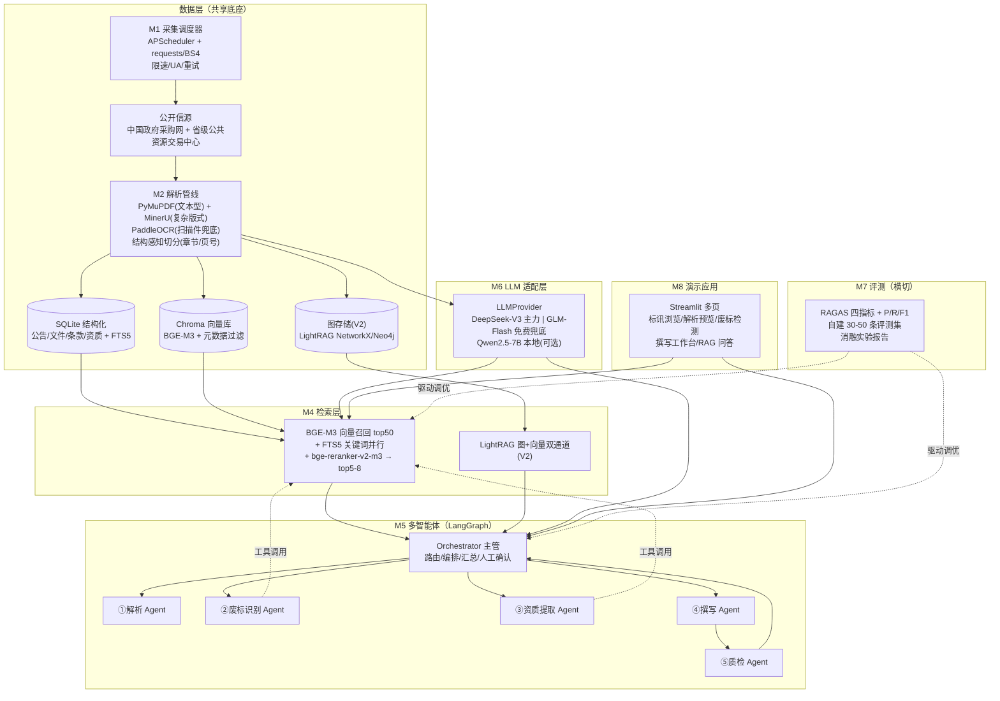

# 04 实现方案：智能投标助手（多智能体）+ 招标知识问答（RAG）

> 版本：v1.0 ｜ 日期：2026-08-17 ｜ 作者：实现方案调研子代理
> 定位：面向简历的两个 AI 项目（招投标方向）的**技术实现方案**，含模块选型对比、推荐技术栈、架构图、工作量与成本估算、风险对策。
> 信源标注规范：`[WebSearch]`=已通过网络检索核验；`[单源⚠️]`=仅单一信源，未交叉验证；`[待核验]`=未能核验或需按环境实测；未标注项=通用工程实践判断。
> 约束前提：个人项目、可落地演示、数据真实可得、预算敏感；用户熟悉 LangChain+Chroma+BGE+Qwen、RAGAS、DeepA2A 多智能体模板。

---

## 1. 项目定位与总体思路

两个项目**共用一个代码仓库、共享数据采集/解析/存储层**，入口分开：

| 项目 | 形态 | 简历主打点 |
|------|------|-----------|
| ① 智能投标助手 | LangGraph 多智能体（Orchestrator + 5 个子 Agent） | 多智能体编排、Function Calling、Human-in-the-loop、量化评测（废标识别 F1 / 资质提取 F1） |
| ② 招标知识问答 | 向量 RAG（V2 升级向量+图 RAG） | RAG 全链路工程、RAGAS 四指标、检索消融实验、图增强对比 |

**关键设计决策（贯穿全文）：**
1. **RAG 作为多智能体的"工具"挂载**，同时提供独立问答入口 —— 一个底座服务两个项目，工作量复用，简历叙事完整。
2. **数据自采自建**（公开平台抓取 + 自建标注评测集），不买商业 API —— 展示"数据采集→解析→入库→检索→评测"全链路，这是简历的差异化亮点。
3. **本地优先、API 按量付费**：Embedding/Rerank/向量库/解析全部本地免费，LLM 用 DeepSeek 按量（月 ¥5-20 量级），预算≈0。
4. **评测先行**：先建 30-50 条招标领域标注评测集，所有模块决策（分块、Embedding、Rerank、图增强）都用指标说话，写进简历。

---

## 2. 模块拆分表

| # | 模块 | 核心问题 | 关键产出 |
|---|------|---------|---------|
| M1 | 数据采集 | 标讯/招标文件从哪来、怎么抓、多快抓一次 | 公告结构化记录 + PDF 附件落盘 |
| M2 | 文档解析 | PDF/Word → 结构化文本与表格 | 带章节/页号的 Markdown + JSON 表格 |
| M3 | 存储层 | 结构化/全文/向量各存哪、元数据过滤 | SQLite + Chroma + FTS5 |
| M4 | RAG 检索 | Embedding/分块/Rerank 选型；图增强值不值 | 检索管线 + 消融实验数据 |
| M5 | 多智能体编排 | 框架选型、子 Agent 划分、工具调用 | LangGraph 流水线（5 Agent） |
| M6 | LLM | 国内 API/本地模型选型、长文档处理 | LLMProvider 多供应商适配层 |
| M7 | 评测 | RAGAS 落地、多智能体指标、评测集构建 | 指标报告（简历数据） |
| M8 | 部署/演示 | 本地/轻量云、界面、成本 | Streamlit 演示应用 |

---

## 3. 各模块方案对比与推荐

### M1 数据采集

**业内主流方案：**

| 方案 | 代表 | 优点 | 缺点 |
|------|------|------|------|
| A. 公开平台 HTML 抓取 | 中国政府采购网（ccgp.gov.cn）、各省公共资源交易中心、中国招标投标公共服务平台（cebpubservice.com） | 免费、数据真实、量大、无需授权即可展示；GitHub 已有同类爬虫项目可参考（"中国政府采购网爬虫"仓库搜索约 10 个结果 `[WebSearch]`） | 无统一 API；站点结构各异；有反爬与合规风险（cebpubservice 的 robots.txt 明确 `Disallow: /` `[WebSearch]`，应避开）；公告正文为 HTML、附件为 PDF，需两级抓取 |
| B. 商业标讯 API | 千里马（qianlima.com）、剑鱼标讯（jianyu360.cn）、招标雷达、比地招标 | 数据全（覆盖全国+历史）、结构化、稳定、附带订阅推送 | 收费且价格不透明（两平台官网均未公开报价，需商务咨询 `[单源⚠️]`）；"开箱即用"反而没有简历展示点 |
| C. 手工收集 + 半自动整理 | 浏览器下载 + 本地脚本入库 | 零反爬风险、启动最快（MVP 首选） | 量小、无"工程感" |

**推荐：A 为主 + C 打底。**
- 目标源：**中国政府采购网 + 1-2 个省级公共资源交易中心**（优先学校/事业单位/信息化类目，贴合教育行业背景，公告密度适中）。**不用**中国招标投标公共服务平台（robots 禁止 `[WebSearch]`）；**不买**商业 API（预算敏感 + 简历要展示采集能力，但采集层抽象出 `DataSource` 接口，未来可无痛切换商业源）。
- 技术：`requests + BeautifulSoup4` 抓列表页与详情页（公告字段：标题/编号/预算/地区/发布时间/采购人/截止时间/附件链接），`Playwright` 仅作兜底（页面 JS 渲染时）；PDF 附件用 `requests` 流式下载。
- 调度：`APScheduler` 每日 1 次增量抓取（招标公告有发布日字段，天然增量）；首次启动做**历史回填**：按"软件/教育/信息化"关键词过滤抓近 12-24 个月，目标 500-1000 条公告、200-300 份招标文件（够建评测集与演示库，不贪多）。
- 反爬应对：随机 UA 池（5-10 个）、请求间隔 3-5 秒、失败指数退避重试（最多 3 次）、单日限流阈值（如 2000 请求/源）；**不做代理池**（个人项目性价比低）。IP 被封的应对顺序：降频 → 换省级源 → 人工补采。
- 数据落地：公告入 SQLite（唯一键=公告编号+来源去重），PDF 存 `data/raw/` 按 `source/date/id` 归档。

**工作量：3-5 人天**（含历史回填脚本与去重逻辑）。

---

### M2 文档解析

**业内主流方案：**

| 方案 | 优点 | 缺点 |
|------|------|------|
| A. PyMuPDF (fitz) | 极快、轻量（pip 即装）、文本型 PDF 抽取质量稳定 | 表格/版式还原弱；扫描件无效 |
| B. MinerU（OpenDataLab） | VLM+OCR 双引擎；PDF/DOCX/PPTX/XLSX→Markdown/JSON；表格→HTML、公式→LaTeX、跨页表格合并；109 语言；CPU/GPU 可跑；新版已移除 AGPL 模型，License 友好 `[WebSearch]` | 首次模型下载大（~2-3GB）；复杂文档解析慢（需 GPU 才快）；中文政务公文类版式效果需实测 |
| C. Docling（IBM） | 版面/表格/OCR 齐全，导出格式丰富（Markdown/JSON/DocTags）`[WebSearch]` | 中文场景生态与社区经验弱于 MinerU；模型较重 |
| D. marker | 快、轻 | 中文表格/复杂版面效果一般 |
| E. OCR 兜底 | PaddleOCR / RapidOCR | 中文识别强、免费 | 纯 OCR 无版面结构，需配合版面分析 |

**推荐：两级管线（PyMuPDF 快速通道 + MinerU 精细通道）+ OCR 兜底。**
- 文本型 PDF：PyMuPDF 抽取文本 + 页号锚点（占招标文件多数，速度快一个量级）。
- 复杂版式（扫描件、表格密集、带章扫描页）：MinerU 出 Markdown（含表格 HTML），**这是评分标准表/资质要求表的主力工具** `[WebSearch]`。
- DOCX/WPS：`python-docx`（招标文件也常见 Word 版）。
- 扫描件兜底：PaddleOCR 文本识别 + 简单版面规则。
- 统一输出 schema：`{doc_id, page_no, section_path（章>节>条）, markdown_text, tables: [json]}`；MinerU 结果与 PyMuPDF 结果按页合并对齐。
- 表格抽取：MinerU 表格识别 → 规则清洗（表头识别）→ LLM（DeepSeek）后处理为结构化 JSON（评分标准表：评分项/分值/评分细则；资质要求表：资质类别/等级/数量）。
- **长文档切分策略（招标文件常 100-300 页）**：先按目录/标题层级做**结构感知切分**（section-aware），主块 800-1000 token、overlap 100-150；长表格独立成块（防止表格被切断）；每块携带 `doc_id/page/section_path` 元数据，供检索过滤与引用溯源。
- **为什么不用 Docling 当主力**：中文招标文件场景 MinerU 中文优化更对口（论文/教材类社区评测多，招标公文需自测 `[待核验]`），Docling 留作 20 份样本的对照实验（简历可写"解析器对比"）。

**工作量：3-5 人天**（含 MinerU 环境安装调优 + 表格后处理 + 切分模块）。

---

### M3 存储层

**结构化存储：**

| 方案 | 优点 | 缺点 |
|------|------|------|
| SQLite（+FTS5） | 零部署、单文件、备份即复制、FTS5 中文全文检索可用；个人项目数据量（千级公告）绰绰有余 | 并发写弱（演示场景无所谓） |
| PostgreSQL（+pgvector） | 功能全、向量+结构化一站式、生产级 | 多一个服务要装要管；个人演示收益低 |

**推荐：SQLite 起步**（结构化表：`announcements / bid_docs / clauses / qualifications / agents / eval_queries`）。**为什么不用 Postgres**：个人项目不想维护服务；但若本机已有 Postgres 环境，可选 pgvector 一站式（二选一，接口层抽象好即可）。

**向量库：**

| 方案 | 优点 | 缺点 |
|------|------|------|
| Chroma | 本地文件、零运维、LangChain 原生集成、元数据 where 过滤、API 简单；与用户技能栈完全匹配 | 单机规模上限（个人项目远够用）；生态相对 Qdrant 弱 |
| Qdrant | 过滤/量化/分布式能力强、Rust 性能好 | 多一个服务进程；小规模无感 |
| Milvus | 生产级、超大规模 | 重（依赖 etcd/minio 等），个人项目杀鸡用牛刀 |
| FAISS | 快 | 纯向量无元数据过滤，招标场景需要"按地区/时间/文档过滤" |

**推荐：Chroma 为主**（本地持久化目录 + 元数据过滤：`source/region/pub_date/doc_type`）。**为什么不用 FAISS**：缺元数据过滤，RAG 检索必须按文档/时间域过滤。**为什么不用 Milvus**：部署运维成本与个人项目不匹配。**为什么不用 Qdrant 起步**：多一个服务、演示环境要额外启动；数据量上到 10 万+ chunk 再迁（Chroma→Qdrant 迁移成本低，接口相似）。
- 全文检索：SQLite FTS5 做**关键词精确匹配兜底**（招标术语如"CMMI5""ISO9001"适合精确命中，与向量检索互补，演示"混合检索"）。
- 图存储（V2 增强）：LightRAG 默认本地 KV+NetworkX（JSON 落盘）`[WebSearch]`；Neo4j Community 可选（免费，可视化惊艳，但多一个 Java 服务，资源占用需实测 `[待核验]`）。

**工作量：1-2 人天**。

---

### M4 RAG 检索

**Embedding 选型：**

| 方案 | 输入上限 | 特点 | 适合度 |
|------|---------|------|--------|
| BGE-M3（FlagEmbedding） | **8192 token** `[WebSearch]` | 多语言；dense+sparse+colbert 三合一；1024 维；本地免费 | ★★★★★ 主力 |
| bge-large-zh-v1.5 | 512 token | 中文语义强、轻快 | ★★★ 短文本场景 |
| text2vec-large-chinese | 512 token | 中文社区常用 | ★★ 上限太短 |
| Qwen3-Embedding-0.6B/4B | **32K** `[WebSearch]` | 可指令化（instruct 提 1-5%）；支持 MRL 降维；0.6B 本地轻量 | ★★★★ 对照实验 |
| Qwen3-Embedding-8B | 32K | 效果最强 | ★★ 显存要求高 |

**推荐：BGE-M3 主力 + Qwen3-Embedding-0.6B 对照。**
- 理由：8192 token 覆盖"条款级"与"评分标准段"长文本（512 上限的 bge-zh/text2vec 切碎长条款会丢语义）；多语言对招标文件中英文混排（设备参数、资质名）友好；与用户技能匹配。
- **为什么不用 text2vec/bge-zh 系列**：512 token 上限是硬伤，招标文件长条款/评分细则动辄上千字，强切会破坏语义完整性。
- 对照实验：C-MTEB 中文检索任务 + 自建评测集上对比 BGE-M3 vs Qwen3-Embedding-0.6B，写进简历。

**分块策略**：结构感知切分（见 M2），主块 800-1000 token；可选 parent-child（父块=章节，子块=段落）提升长文召回，作为消融实验项。

**Rerank：必须加（推荐本地 bge-reranker-v2-m3，免费；或 Qwen3-Reranker API）。**
- 理由：招标场景"废标条款/资质要求"属于**精确条款召回**，top-k 精度直接决定下游质量；RAGAS 的 context_precision 指标在加 Rerank 前后差异明显，正好是简历量化点。召回 top50 → Rerank top5-8 进上下文。

**向量 RAG vs 向量+图 RAG（V2 增强）：**

| 维度 | 向量 RAG | 向量 + 图 RAG（LightRAG 路线） |
|------|---------|------------------------------|
| 能力 | 片段级语义召回 | 额外支持**实体关联**：企业-项目-资质-条款图谱；跨文档聚合（"哪些项目要求 CMMI5？""A 公司中标了哪些项目"）；多跳问题 |
| 增量价值 | 基线 | 全局/关联类问题 recall 提升（LightRAG 双通道：图+向量 `[WebSearch]`） |
| 实现成本 | 低 | 中等：实体/关系抽取靠 LLM（DeepSeek 按量，千级文档约几元）；LightRAG 已集成 Rerank/RAGAS/Langfuse，支持增量更新与文档删除 `[WebSearch]` |
| 为什么不用 MS GraphRAG | — | 社区报告生成重、LLM 调用成本高、中文支持一般；LightRAG 是社区公认的轻量替代 |

**推荐：V1 纯向量 RAG（先跑通 RAGAS 基线）→ V2 加 LightRAG 图增强**，用自建"关联类"测试题（10-15 条多跳/聚合问题）对比两组 context_recall，量化图增强价值写简历。图可视化用 LightRAG WebUI 或 Neo4j Browser，演示效果好。

**工作量：V1 3-4 人天；V2（LightRAG 集成+对比实验）5-8 人天**。

---

### M5 多智能体编排

**框架选型：**

| 方案 | 优点 | 缺点 |
|------|------|------|
| **LangGraph** | 图状态机显式可控；checkpoint/断点续跑；原生 human-in-the-loop（interrupt）；与 LangChain/RAGAS 同生态，用户技能零迁移成本；简历认可度高 | 学习曲线略陡（StateGraph 概念） |
| CrewAI | 角色化上手最快 | 任务委托偏黑盒，调试/指标采集/状态控制弱 |
| AutoGen | 对话式多智能体、学术影响力大 | 对话驱动状态管理复杂，工程化体验一般 |
| OpenAI Swarm | 极轻量、教学友好 | 实验性质，官方定位非生产，不适合做简历主项目 |
| 自研编排（DeepA2A 风格） | 完全可控、教学价值高 | 无生态（无 checkpoint/可视化/社区）；工程量大，个人项目时间不允许 |

**推荐：LangGraph 为主**，理由：与用户 LangChain 技能栈一致；图结构天然表达"解析→识别→提取→撰写→质检"流水线；interrupt 机制支撑投标场景的**人工确认节点**（关键产出让用户确认后再继续，演示互动性强）；简历"LangGraph 多智能体"是当前高认可度关键词。
**为什么不用 CrewAI**：黑盒委托导致"每个 Agent 产出的指标采集"难做，而本项目核心卖点就是量化评测。**为什么不用自研**：时间成本高、无生态；DeepA2A 风格可以降级为"一个简化版编排器"作为对照实验写简历（可选加分项，不阻塞主线）。

**子 Agent 划分（5 + 1）：**

| Agent | 职责 | 输入 → 输出 |
|-------|------|------------|
| Orchestrator（主管） | 意图路由、任务编排、结果汇总、人工确认节点 | 招标文件 → 分派各 Agent → 汇总报告 |
| ① 解析 Agent | 调用解析管线（M2）与存储层，产出结构化文档 | PDF → 章节/表格 JSON |
| ② 废标识别 Agent | 识别无效投标/拒收条款（未盖章、未签字、格式不符、保证金、密封、联合体、偏离等） | 条款清单：{原文引用, 页码, 条款类型, 严重级别} |
| ③ 资质提取 Agent | 提取资格条件（营业执照/资质等级/业绩/人员证书/财务/信用记录） | 结构化 JSON（schema 校验） |
| ④ 撰写 Agent | 按评分标准生成标书响应框架与初稿（分节生成） | 响应初稿（Markdown） |
| ⑤ 质检 Agent | 对照废标清单 + 评分表审查初稿，输出风险报告与修改建议 | 风险报告（checklist 逐项） |

> ⑤质检 Agent 是差异化亮点：形成"生成-自检"闭环，比单 Agent 生成更可信，也天然产出评测指标。

**工具调用（Function Calling / MCP）**：V1 用 LangChain 工具（`rag_query` 招标知识检索、`sql_query` 结构化查询、`doc_parse`、`file_write`）；**MCP 作为 V2 增强**——把工具暴露为标准 MCP Server（简历亮点：Agent 工具标准化），用 `langchain-mcp-adapters` 接入，成本约 2 人天。

**为什么不用 DeepA2A 模板直接做**：它适合快速出原型/教学，但生产级工程特性（checkpoint、可观测、评测挂接）不足；可在文档中注明"参考 DeepA2A 的编排思想，工程化用 LangGraph 实现"。

**工作量：6-10 人天**（5 Agent + Orchestrator + 工具层 + 人工确认交互）。

---

### M6 LLM

**国内 API 选型：**

| 供应商 | 模型 | 上下文 | 价格（¥/百万 token，量级） | 备注 |
|--------|------|--------|--------------------------|------|
| DeepSeek | deepseek-chat (V3) | 128K | 输入 ≈¥1.6（缓存未命中，缓存命中≈¥0.05）、输出 ≈¥4.8（非高峰）`[WebSearch]` | 性价比之王、中文强、工具调用稳 → **主力** |
| 智谱 GLM | GLM-4.7-Flash / GLM-4-Flash | 200K / 128K | **免费** `[WebSearch]` | 零成本兜底/评测 judge；注意限流额度 `[待核验]` |
| 阿里 Qwen | qwen-plus / qwen-long | 128K / 超长档 | 未核验 `[待核验]` | 阿里生态、中文强；qwen-long 适合超长文档 |
| 月之暗面 Kimi | kimi-k2 系列 | 128K-256K | 未核验 `[待核验]` | 长上下文、中文好 |

**推荐：DeepSeek-V3 主力 + GLM-Flash 免费兜底**，抽象 `LLMProvider` 接口（OpenAI 兼容格式，切换成本≈0），简历可写"多供应商容错与成本优化（实测 DeepSeek 单价最低、GLM 免费档兜底）"。**为什么不用 Kimi/Qwen 主力**：价格与 DeepSeek 相比无优势（Kimi 定价未核验），DeepSeek 足够覆盖场景。

**本地部署选项（演示/离线用）：**
- Qwen2.5-7B-Instruct：4bit 量化 ≈6GB 显存，FP16 ≈15GB（24GB 消费卡可跑）`[通用实践]`
- Qwen2.5-14B-Instruct：4bit ≈10-12GB，FP16 ≈28GB `[通用实践]`
- 结论：本地模型仅作**离线演示/断网兜底**，质量（尤其结构化抽取与长文遵循）明显低于 DeepSeek API，**不做主力**；预算允许时用 Ollama/vLLM 起一个 7B 作为"本地 vs API"对比实验（简历加分）。

**长文档处理：128K 够不够？**
- 招标文件核心章节（招标公告+投标人须知+评分办法+合同条款）通常 30-80K token，128K **够单次塞入**；但推荐 RAG 为主（成本 + 可溯源），仅在"全文一致性检查"场景用长上下文直接读（或用 qwen-long/GLM-200K 档）。
- 超过 128K：分层摘要（MapReduce）或分卷问答。

**工作量：1-2 人天**（Provider 适配层 + 提示词模板库）。

---

### M7 评测（简历量化核心）

**RAGAS 在招标场景的落地：**
- 指标族：Faithfulness（忠实度）、Context Precision（上下文精确率）、Context Recall（上下文召回率）、Semantic Similarity；注意新版 RAGAS 文档中 Answer Relevancy 位置有调整（当前文档主推指标以官方 docs 为准 `[WebSearch]`，落地按安装版本核对 `[待核验]`）。
- 落地要点：judge LLM 用 DeepSeek/GLM（RAGAS 支持自定义 LLM，中文判定一致性更好）；**跑消融实验**：不同分块策略 / 是否 Rerank / BGE-M3 vs Qwen3-Embedding / V1 向量 vs V2 图增强，输出指标对比表——这就是简历上"检索管线优化使 context precision 提升 X%"的来源。

**多智能体效果评估：**

| 任务 | 指标 | 评测集 | 目标值（示例，以实测为准） |
|------|------|--------|--------------------------|
| 废标条款识别 | 条款级 P/R/F1（位置+类型） | 人工标注 20-30 份招标文件的废标条款位置 | F1 ≥ 0.90 |
| 资质要求提取 | 字段级 F1（资质名/等级/数量/有效期/证明文件） | 标注 30-50 份文件的资质段 | F1 ≥ 0.85 |
| 撰写质量 | 评分标准覆盖率 + LLM-as-judge 打分（对照评分细则） | 10 份文件抽检 | 覆盖率 ≥ 0.8 |
| 端到端 | 成功率/耗时/人工修正次数 | 10 份全流程跑批 | 记录即可 |

**评测集构建**：30-50 条 RAG QA（公告类：预算/截止时间/联系方式；文件类：资质/评分/废标/保证金）+ 20-30 份文件级标注。标注方式：先 LLM 预标注 → 人工校对（教师本人即可，2-3 天）。**为什么标注样本数定这个量级**：个人项目标注成本与统计可信度的平衡点；简历写法是"自建 XX 条招标领域评测集"而非"大规模数据集"。

**工作量：4-6 人天**（含标注与评测脚本）。

---

### M8 部署/演示

| 方案 | 优点 | 缺点 |
|------|------|------|
| 纯本地（推荐主形态） | 0 成本；演示用录屏/现场；开发调试最快 | 面试官无法远程体验 |
| Streamlit 多页应用 | 表单+对话+图表一体化；与 Python 栈一致；多页面组织（标讯浏览/解析结果/废标检测/撰写工作台/RAG 问答）清晰 | 纯前端能力弱（本项目不需要） |
| Gradio | Chatbot 组件体验好 | 多页/复杂表单弱于 Streamlit |
| 轻量云（可选） | 在线 demo 加分 | 2C4G 轻量服务器 ¥60-100/月；embedding/解析本地跑、云端只放 API+前端也行 |

**推荐：本地为主 + Streamlit**（5 个页面：①标讯浏览（数据采集成果）②文件解析预览 ③废标风险检测（Agent 报告）④资质提取与撰写工作台（含人工确认节点演示）⑤RAG 问答（含检索依据展示：命中章节+页码）。**为什么不用 Gradio 主力**：多页应用和表单工作流（撰写工作台）Streamlit 更合适；RAG 问答页可内嵌对话组件。

**成本估算（月度）：**

| 项 | 方案 | 月成本 |
|----|------|--------|
| LLM API | DeepSeek 按量（演示级：日均 200 次调用、每次 ~2K token） | ¥5-20 |
| LLM 兜底 | GLM-4.7-Flash 免费档 `[WebSearch]` | ¥0 |
| Embedding/Rerank | BGE-M3 + bge-reranker-v2-m3 本地 | ¥0 |
| 向量库/数据库 | Chroma + SQLite 本地 | ¥0 |
| 文档解析 | MinerU 本地（模型下载一次性 ~3GB） | ¥0 |
| 云服务器（可选） | 阿里云/腾讯云 2C4G 轻量 | ¥60-100 |
| 商业标讯 API（不建议） | 千里马/剑鱼 | 未公开 `[单源⚠️]` |
| **合计** | **核心方案** | **¥5-20/月（≈0）** |

**工作量：2-3 人天**（Streamlit 应用 + 演示脚本/录屏准备）。

---

## 4. 推荐技术栈总览

| 层 | 选型 | 版本/说明 |
|----|------|----------|
| 语言/环境 | Python 3.11 + uv | 统一虚拟环境 |
| 数据采集 | requests + BeautifulSoup4 + Playwright（兜底）+ APScheduler | 3-5 秒限速、随机 UA |
| 文档解析 | PyMuPDF + MinerU + PaddleOCR（兜底）+ python-docx | 输出 Markdown+JSON，带页号锚点 |
| 结构化存储 | SQLite + SQLAlchemy + FTS5 | 去重、全文检索 |
| 向量存储 | Chroma（持久化目录） | 元数据过滤 |
| 图存储（V2） | LightRAG（NetworkX/JSON）→ Neo4j Community（可选） | 双通道图+向量 |
| Embedding | BGE-M3（FlagEmbedding，本地）｜对照：Qwen3-Embedding-0.6B | 8192 token |
| Rerank | bge-reranker-v2-m3（本地） | top50→top5-8 |
| 编排 | LangGraph + LangChain（LCEL/工具）｜MCP（V2） | 5 Agent + Orchestrator |
| LLM | DeepSeek-V3 主力；GLM-4.7-Flash 免费兜底；本地 Qwen2.5-7B 可选演示 | OpenAI 兼容适配层 |
| 评测 | RAGAS + sklearn（P/R/F1）+ 自建标注集 | DeepSeek 作 judge |
| 界面 | Streamlit（5 页） | 本地启动 |
| 代码管理 | Git + 模块化目录（采集/解析/存储/检索/agents/评测/app） | 单仓库双入口 |

---

## 5. 架构图（Mermaid）

---

## 6. 工作量与成本汇总

| 阶段 | 内容 | 人天 |
|------|------|------|
| MVP（第 1 个月） | M1 采集（最小集）+ M2 解析（文本型）+ M3 存储 + V1 向量 RAG + RAG 问答页 | 12-16 |
| 核心（第 2 个月） | M7 评测集与 RAGAS + M5 多智能体（先 3 个 Agent：解析/废标/资质）+ M8 界面 | 15-20 |
| 增强（第 3 个月） | ⑤质检 Agent + 撰写 Agent + Rerank/消融实验 + M4 V2 图增强 + MCP（可选） | 10-16 |
| **合计** | | **约 35-50 人天（业余 2.5-3 个月）** |

**预算：核心方案月成本 ¥5-20（仅 DeepSeek API），一次性 0 元（全部开源免费组件）；可选云服务器 ¥60-100/月。**

---

## 7. 风险与对策

| # | 风险 | 等级 | 对策 |
|---|------|------|------|
| 1 | 数据源反爬/IP 封禁；合规红线 | 高 | 仅抓公开公告信息、遵守 robots（cebpubservice 明确禁止 → 避开 `[WebSearch]`）；限速 3-5s + 低并发 + 失败降频；多源互备（ccgp + 2 个省级）；最坏情况降级为手工收集（MVP 不受阻） |
| 2 | 扫描件/复杂表格解析质量不达预期 | 中 | MinerU+OCR 双通道兜底；抽检 5% 样本人工核对；失败样本进"待人工"队列，不影响主流程 |
| 3 | 中文 RAG 指标波动、judge 不稳定 | 中 | 固定评测集 + 固定 judge LLM（DeepSeek）；所有调优以消融实验数据为准，不凭感觉 |
| 4 | LLM 幻觉（编造废标条款/资质） | 高 | 强制"原文引用"输出（条款编号+页码）；质检 Agent 交叉验证；Orchestrator 人工确认节点兜底 |
| 5 | 本地模型/解析器资源不足（无 GPU 卡） | 中 | API 主力不依赖本地推理；MinerU 有 CPU 模式（慢但可用）；Embedding 用 CPU 即可 |
| 6 | 预算失控 | 低 | 免费档兜底（GLM-Flash/BGE 本地）；设置 DeepSeek 月度消费告警（¥50 上限） |
| 7 | 时间不够（3 个月业余） | 中 | 严格执行 MVP→核心→增强裁剪顺序；图增强/MCP 为可裁剪项；先保证"废标识别+资质提取+RAG 问答+评测报告"这条主线闭环 |
| 8 | 数据量不足影响演示 | 中 | 历史回填一次性抓 500-1000 条；RAG 演示库 200-300 份文件足够 |

---

## 8. 待核验清单（留给实施阶段）

| # | 事项 | 影响 | 核验方式 |
|---|------|------|---------|
| 1 | ccgp.gov.cn 的 robots.txt 与反爬现状（本次探测返回错误页）`[待核验]` | 决定主数据源可行性 | 实施时手工访问 + 少量试抓 |
| 2 | 千里马/剑鱼商业 API 具体报价（官网未公开）`[单源⚠️]` | 若采集受阻的备选成本 | 商务咨询（仅作备选，不阻塞） |
| 3 | MinerU 对招标文件（政务公文/评分表）版式的实际效果 `[待核验]` | 解析质量与工作量 | 10 份真实招标文件实测（实施第 1 周） |
| 4 | Qwen3-Embedding-4B/0.6B 本地部署显存与速度 `[待核验]` | 对照实验可行性 | 本机实测 |
| 5 | 当前版本 RAGAS 的 answer_relevancy 弃用状态与指标清单 `[待核验]` | 评测脚本 API 兼容 | pip 安装后读官方文档 |
| 6 | Kimi/Qwen（百炼）最新 API 价格 `[待核验]` | 成本对比表准确性 | 官网控制台 |
| 7 | GLM-4.7-Flash 免费档限流额度 `[待核验]` | 兜底方案稳定性 | 注册后实测 |
| 8 | Neo4j Community 本地资源占用（若选可视化）`[待核验]` | V2 图演示方案 | 本机实测 |
| 9 | 省级公共资源交易平台的 robots/反爬差异 `[待核验]` | 多源策略 | 逐个站点探测 |

---

## 9. 简历叙事建议（一句话总结本方案卖点）

> 自建"采集-解析-检索-多智能体-评测"全链路招投标 AI 系统：LangGraph 编排 5 个 Agent 完成招标文件解析、废标条款识别（F1≥0.90）、资质提取（F1≥0.85）与标书初稿生成，并挂载 BGE-M3+Rerank 的中文 RAG 问答工具（RAGAS 四指标消融优化，V2 图增强）；全程本地免费组件 + DeepSeek 按量，月成本 <¥20。
