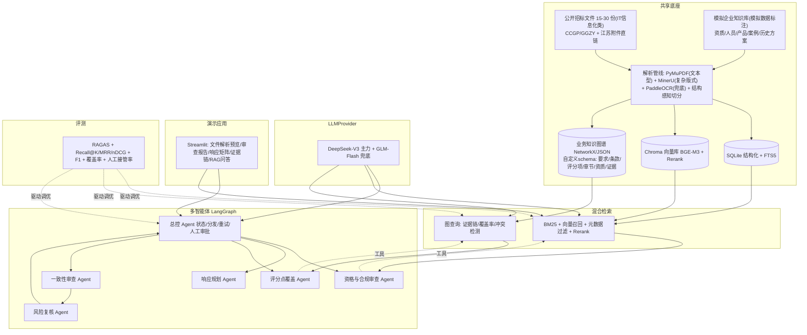

# 06 方向校准：对齐《项目方向选型论证-招标书-修改版》的决策增量

> 日期：2026-08-17 ｜ 校准人：主 session（圆圆）
> 输入：05-决策汇总.md（4 路调研收口）＋ 《项目方向选型论证-招标书-修改版.md》（用户方向文档，205 行）
> 结论：**不需要重新调研**。4 路调研结论 90% 继续成立；本文件记录 5 个差异点的校准决策（C1-C5），作为 05 决策汇总的增量修订。

---

## 0. 校准速览

| # | 差异点 | 05 调研版 | 方向文档版 | 校准决策 | 影响 |
|---|--------|-----------|-----------|---------|------|
| C1 | 数据策略 | 公开爬取 500-1000 公告、200-300 招标文件 | 15-30 份 IT 信息化类公开招标文件 + 模拟企业知识库（明确标注） | **采纳文档口径**：语料收窄、聚焦单类型、新增模拟企业数据设计 | 02 数据源结论保留但规模调整 |
| C2 | 图RAG 定位 | V2 可选增强（LightRAG） | **项目二核心**，实体关系已定义（要求→评分项→响应章节→证明材料→资质/案例） | **升级为核心**；选型裁决：自定义业务 schema（LLM 结构化抽取 + NetworkX/Neo4j）为主，LightRAG 作对照 | 04 模块 M4 重大调整 |
| C3 | Agent 划分 | 解析/废标/资质/撰写/质检 5 Agent | 资格合规/响应规划/评分覆盖/一致性/风险复核 5 Agent + 总控 | **采纳文档划分**（更贴「审查+规划」定位）；「稳定步骤先工具化」原则写入 | 04 模块 M5 调整 |
| C4 | 评测体系 | RAGAS 四指标 + 废标 F1/资质 F1 | Recall@K/MRR/nDCG、证据缺口、人工接管率、覆盖率等 | **合并**：RAGAS 保留 + 文档工程指标补充 | 04 模块 M7 扩充 |
| C5 | 工作台元素 | 未覆盖（简历项目视角） | 报价测算、提交留痕、受控分发 | **V1 裁剪**：报价测算=Excel 导入输入；留痕=轻量版本记录；不做完整工作台 | V1 范围收敛 |

---

## C1 数据策略校准（采纳文档口径）

### 变化点

| 维度 | 05 调研版 | 校准后 |
|------|-----------|--------|
| 公开语料规模 | 500-1000 公告、200-300 招标文件 | **15-30 份 IT 软件/信息化服务类公开招标文件**（文档第 6 节） |
| 抓取范围 | 全类型（货物/工程/服务） | **仅 IT 信息化类**（文档结构、企业资料、评分逻辑相对一致） |
| 测试集 | 30-50 条 QA + 20-30 份文件标注 | **3-5 份人工标注**作为独立测试集（文档第 6 节） |
| 新增部分 | 无 | **模拟企业知识库**：企业资质/证书、人员经历、产品参数、历史案例、历史技术方案（**明确标注模拟数据，不冒充真实**，文档第 3 节） |

### 落地要点

1. **公开语料**：CCGP/GGZY 按「IT 软件 / 信息化服务 / 软件开发」品目筛选，江苏附件直链通道保留（02 实测利好全文语料）；不追求量大，追求**同类型、结构完整**（含评分办法、实质性条款、资格要求三件套）。
2. **模拟企业知识库**：设计 1 家虚构企业（如「XX 信息科技有限公司」），覆盖：营业执照/资质证书（ISO、CMMI、软著）、人员简历（项目经理/PMP/软考）、产品参数、5-8 个历史中标案例（含技术方案片段）。**所有模拟数据在代码与文档中带 `[SIMULATED]` 标注**，README 明示。
3. **数据合规**：02 文档的合规边界结论不变（CCGP/GGZY 免登录、CEBP 不爬、控频）；模拟数据不涉及个人信息。

---

## C2 图RAG 选型裁决（升级为核心 + 选型小核验）

### 核验证据（2026-08-17 实测 LightRAG 源码）

| 事实点 | 证据 |
|--------|------|
| LightRAG 支持自定义实体类型 | 源码 `lightrag.py` L1228-1233：`ENTITY_TYPES` 环境变量**已废弃**，改为 `addon_params={'entity_types_guidance': '...'}` 或替换 prompt template 引导实体类型 |
| 抽取方式 | LLM 自由抽取 + 提示词引导（`entity_types_guidance`），**非硬 schema 约束** |
| JSON 输出 | `ENTITY_EXTRACTION_USE_JSON` 可开，抽取更稳定但更耗 token |
| 结论 | LightRAG 可引导但**无法强制业务 schema**：`招标要求→评分项→响应章节→证明材料→资质` 这类强业务关系链，靠引导不可控 |

### 裁决：自定义业务 schema 为主，LightRAG 仅作对照

| 方案 | 优点 | 缺点 | 裁决 |
|------|------|------|------|
| **A. 自定义 schema 图谱**（LLM 结构化抽取 + 预定义实体/关系 + NetworkX/Neo4j） | 实体关系完全可控、与文档定义 1:1 对应；证据链查询确定性强；评测可量化 | 需自建抽取 prompt + schema 校验（工作量 +3-5 人天） | ✅ **V2 主方案** |
| B. LightRAG（自定义 guidance） | 开箱即用、有论文背书 | 实体抽取不可控，业务 schema 靠提示词「碰运气」；中文实体质量依赖 LLM | ⚪ **对照实验**（证明「为什么自研 schema」） |
| C. MS GraphRAG | 成熟 | 重、贵、中文一般（05 已裁决排除） | ❌ |

### 业务图谱 schema（对齐方向文档第 3 节）

```
实体：招标要求 / 实质性条款 / 评分项 / 响应章节 / 企业资质 / 人员 / 项目案例 / 证明材料 / 文件来源
关系：招标要求─包含→实质性条款
      实质性条款─对应→评分项
      评分项─由→响应章节 响应
      响应章节─引用→证明材料
      证明材料─支撑→企业资质
      企业资质─匹配→实质性条款
      人员/项目案例─关联→证明材料
```

- **存储**：V1 用 NetworkX + JSON 持久化（零运维）；Neo4j Community 可选（可视化、资源占用待实测）。
- **构建**：DeepSeek 结构化输出（Function Calling 强制 JSON schema）抽实体关系；单份招标文件先建「文件内证据链」，再与模拟企业知识库建「跨库证据链」。
- **查询路由**：关系链类问题（"哪份证书支撑评分项 3.2？"）走图查询；语义类问题走向量；混合结果统一带来源引用。
- **简历叙事**：「自研业务知识图谱 schema + LLM 结构化抽取，替代通用 GraphRAG 的自由抽取，证据链覆盖率提升 X%」——比直接用 LightRAG 更有差异化。

---

## C3 Agent 划分对齐（采纳文档定义）

### 校准后：总控 + 5 专业 Agent

| Agent | 职责（方向文档第 2 节） | 与 05 版对应 |
|-------|------------------------|-------------|
| **总控 Agent** | 维护任务状态、分发子任务、失败重试、人工审批 | Orchestrator |
| **资格与合规审查 Agent** | 比对企业资质与实质性要求，标记不满足项和证据缺口 | 原「资质提取」+「废标识别」合并升级 |
| **响应规划 Agent** | 生成投标文件目录、章节任务、响应策略 | 原「撰写 Agent」前置拆分 |
| **评分点覆盖 Agent** | 建立「评分项—响应章节—证明材料」映射，计算覆盖率 | 新增（差异化亮点） |
| **一致性审查 Agent** | 检查人员/日期/金额/参数/案例跨章节冲突 | 新增（差异化亮点） |
| **风险复核 Agent** | 汇总废标风险、材料缺失、人工确认事项 | 原「质检 Agent」升级 |

### 写死的工程原则（方向文档第 2 节原话精神）

> 文档解析、表格抽取和规则匹配等**稳定步骤优先实现为工具或工作流节点**；只有需要独立决策、不同上下文或并行协作的任务才使用 Agent，**避免为了数量硬拆角色**。

- 解析、分块、BM25、规则校验 → LangGraph **普通节点/工具**，不设 Agent；
- Agent 只做：资格判断、响应规划、覆盖计算、冲突检测、风险汇总（需独立上下文/决策）；
- 每个 Agent 结构化输入输出（Pydantic schema），保证可评测、可追溯。

---

## C4 评测体系合并（RAGAS + 工程指标）

### 合并后评测矩阵

| 层 | 指标（方向文档第 7 节） | 工具 | 05 版对应 |
|----|------------------------|------|-----------|
| 文档解析与抽取 | 实质性条款识别 P/R/F1；资格与评分项抽取准确率；表格字段解析成功率；页码/原文位置保留率 | 自建标注集（3-5 份） | 废标 F1 拆分细化 |
| RAG 检索 | **Recall@K / MRR / nDCG**；证明材料匹配准确率；引用正确率；**图检索 vs 纯向量增益**；无证据正确拒答率 | RAGAS + 自建 | RAGAS 四指标保留并细化 |
| 多智能体工作流 | 强制性要求覆盖率；评分项覆盖率；证据缺口识别准确率；跨章节冲突检测准确率；Agent 成功率/重试率/人工接管率；耗时对比 | 自建评测集 + LangGraph 检查点统计 | 新增 |

### 简历量化点更新

- 旧：「废标识别 F1≥0.90、资质提取 F1≥0.85」
- 新：**「实质性条款识别 F1≥0.90、评分项覆盖率≥0.95、证据缺口识别准确率≥0.85、图检索相对纯向量 Recall@K 提升 X%、跨章节冲突检测准确率≥0.90」**

---

## C5 工作台元素裁剪（V1 边界收敛）

方向文档背景提到「标书自动生成与审核工作台」的完整愿景（数据接入、指标计算、竞品对比、报价初算、公告摘要、提交留痕等），但第 8 节最终项目定位收敛为两个可独立展示的系统。校准如下：

| 工作台元素 | V1 处理 | 理由 |
|-----------|---------|------|
| 数据接入（公告/文件） | ✅ 纳入（CCGP/GGZY 采集 + 手动上传） | 语料底座 |
| 公告摘要 | ✅ 纳入（RAG 问答自然输出） | 低成本 |
| 指标计算/报价测算 | ⚪ **仅 Excel 模板导入**作为「响应规划 Agent」输入，不建测算引擎 | 报价模型属业务机密且因人而异，V1 不碰 |
| 竞品方案对比 | ⚪ 简化为「同类历史案例检索」（RAG 能力） | 完整竞品分析需行业数据 |
| **提交留痕/版本管理** | ✅ **轻量模块**（版本号+时间戳+提交记录+简单回滚） | 方向文档第 1 节痛点 6 明确要求，但只做最小闭环 |
| 受控分发/客户版 | ❌ 不做（V2+） | 超出简历项目展示范围 |
| 投标质量评估/模型回测 | ❌ 不做（V2+，方向文档自述为扩展项） | 同上 |

**V1 边界一句话**：「输入项目代码/招标文件 → 解析入库 → 多智能体合规审查与响应规划 → RAG 证据检索 → 输出审查报告 + 响应任务清单 + 标书初稿 → 轻量留痕」。

---

## 更新后架构图



---

## 技术栈变更汇总（相对 05）

| 模块 | 05 版 | 校准后 | 变更原因 |
|------|-------|--------|---------|
| 图谱 | LightRAG（V2 可选） | **自定义 schema 图谱（NetworkX/JSON）+ LLM Function Calling 抽取**；LightRAG 仅对照 | C2 裁决：业务 schema 需可控 |
| Agent 划分 | 解析/废标/资质/撰写/质检 | **总控+资格合规/响应规划/评分覆盖/一致性/风险复核** | C3 对齐方向文档 |
| 语料规模 | 500-1000 公告/200-300 文件 | **15-30 份 IT 信息化类 + 模拟企业知识库** | C1 采纳文档口径 |
| 评测 | RAGAS 四指标 + F1 | **+ Recall@K/MRR/nDCG + 覆盖率 + 人工接管率 + 拒答率** | C4 合并 |
| 新增模块 | 无 | **模拟企业数据生成器 + 轻量留痕模块** | C5 |
| 不变 | LangGraph / BGE-M3 / bge-reranker / Chroma / SQLite / DeepSeek / Streamlit / RAGAS | 同左 | 与既有栈兼容 |

---

## 工作量与成本更新

| 阶段 | 内容 | 人天 |
|------|------|------|
| MVP（第 1 月） | 15-30 份语料采集 + 解析 + 模拟企业库 + 存储 + V1 向量 RAG + RAG 问答页 | 10-14 |
| 核心（第 2 月） | 评测集（3-5 份标注）+ RAGAS/检索指标 + 多智能体（4 Agent + 总控）+ Streamlit | 14-18 |
| 增强（第 3 月） | 评分覆盖/一致性 Agent + 自定义图谱（schema 抽取+证据链查询）+ LightRAG 对照 + 留痕 + 消融 | 12-18 |
| **合计** | | **约 36-50 人天**（与 05 持平，图谱自研抵消了语料减少） |

**成本不变**：核心月 ¥5-20（DeepSeek API）；本地组件免费；云服务器可选 ¥60-100/月。

---

## 待办移交更新

在 05 待办基础上，校准新增/调整项：

### 新增（技术）
- [ ] 设计业务图谱 schema 的 Pydantic 模型 + LLM 抽取 prompt（Function Calling JSON schema 约束）——C2 核心实现件
- [ ] 模拟企业知识库数据生成（1 家虚构企业：资质/人员/产品/5-8 案例，全部 [SIMULATED] 标注）
- [ ] LightRAG 对照实验基线记录（证明自研 schema 的增量价值）

### 调整（原 05 待办）
- [ ] 数据采集目标从「500-1000 公告」改为「**15-30 份 IT 信息化类招标文件**（含评分办法/实质性条款/资格要求三件套）」
- [ ] 3-5 份人工标注测试集（原 30-50 条 QA 降量，保留 RAGAS 最少可用样本）

### 不变（沿用 05）
- [ ] 解压研读 `_evidence/bulletin-info.rar`（CEBP 接口规范，schema 设计参考）
- [ ] 注册 1-2 个省级供应商账号验证 B 类下载通道
- [ ] 10 份真实文件 MinerU vs Docling 对照
- [ ] 简历目标岗位确认（影响演示侧重）
- [ ] 时间预算确认（3 个月业余）

---

## 版本关系说明

- `05-决策汇总.md` 为调研基线（4 路并行成果收口）；
- `06-方向校准.md` 为对齐用户方向文档的**增量修订**，C1-C5 裁决优先于 05 对应条目；
- 后续 brainstorming / PRD 以 **05 + 06 合并版**为输入（06 覆盖冲突处）。
